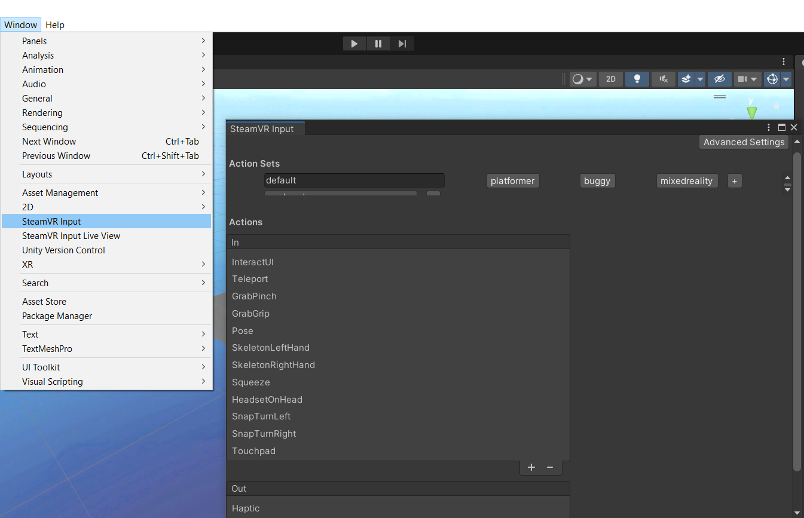

# 🎮 Vive Controller Binding Setup (SteamVR Plugin Branch)

## ❗ Why this is important

This configuration file is **required for proper movement and interaction in the VR environment** when using the **SteamVR plugin branch** of the project. It defines **custom input bindings** for the HTC Vive controllers, enabling features such as:

- Walking/movement input  
- UI interaction

Without this configuration, the default SteamVR bindings **will not trigger** the necessary in-game actions, and the VR experience may not function correctly.

---

## 📁 Binding File

The binding configuration file is located at:
TFM_VR_Experimentation/Assets/InputActions/Binding/tfm_final_exe_vive_controller_My TFM_Final [Testing] configuration for Vive Controller.json

## Follow these steps to apply the correct controller configuration:

1. Connect your **HTC Vive headset and controllers**.
2. **Open Unity Editor** with your project loaded.
3. In the Unity menu bar, go to **Window → SteamVR Input**.

4. In the SteamVR Input window, click **"Open bindings"**.
5. In the bindings editor:
   - Click **"Edit"** next to your controller configuration.
   - Navigate to the **trackpad/touchpad** section.
   - Configure the touchpad mappings as needed:
     - **Left trackpad**: Movement input (`/actions/default/in/touchpad`)

6. Click **"Save Personal Binding"** to apply the configuration.

---

✅ Your HTC Vive controllers are now correctly configured for movement and interaction in the VR environment.
